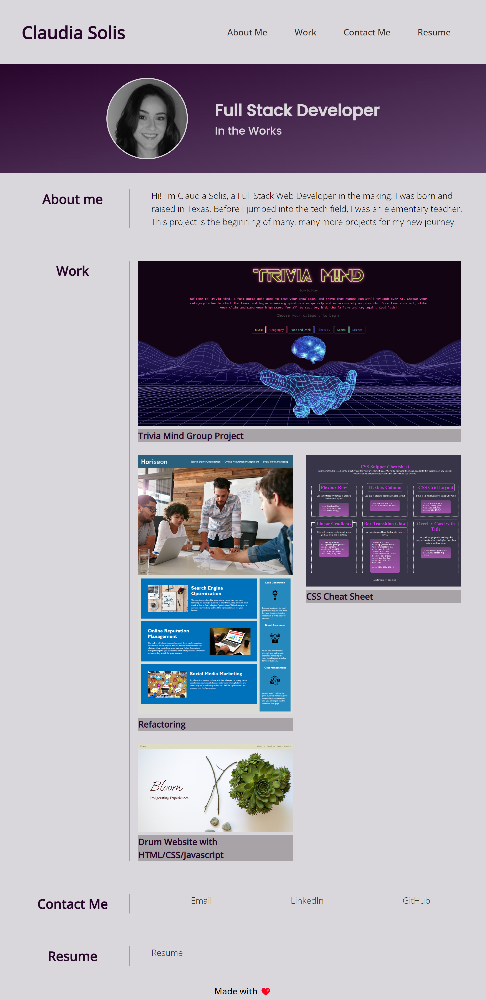

# Week 2 Challenge _ Personal Portfolio

## Description
This project is my personal portfolio to showcase the skills I have learned thus far in the UT bootcamp. Skills that were practiced were: grid and flex layouts, media query for different devices, adding external links and to sections of the page, commenting and refactoring code and other styling properties. 

## Installation
- copy github https/ssh link
- git clone to terminal with github https/ssh link

## Usage

https://cjsolis12.github.io/Personal_Portfolio_Week2/

## Credits

- https://www.w3schools.com/html/html_elements.asp

- Photo by <a href="https://unsplash.com/@dylan_nolte?utm_source=unsplash&utm_medium=referral&utm_content=creditCopyText">dylan nolte</a> on <a href="https://unsplash.com/s/photos/solid-background?utm_source=unsplash&utm_medium=referral&utm_content=creditCopyText">Unsplash</a>
